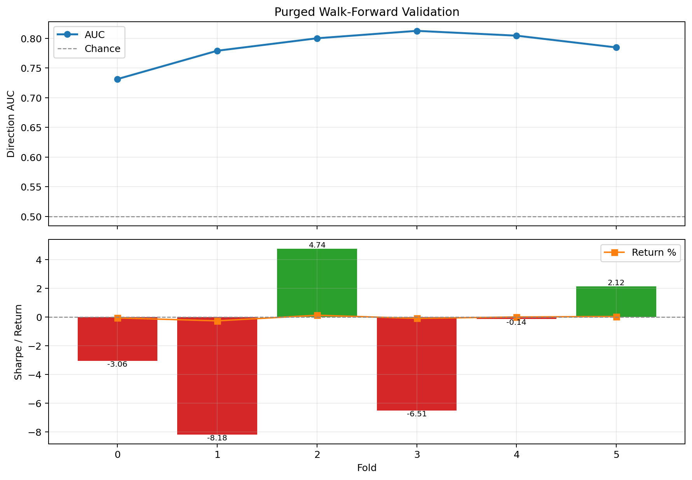
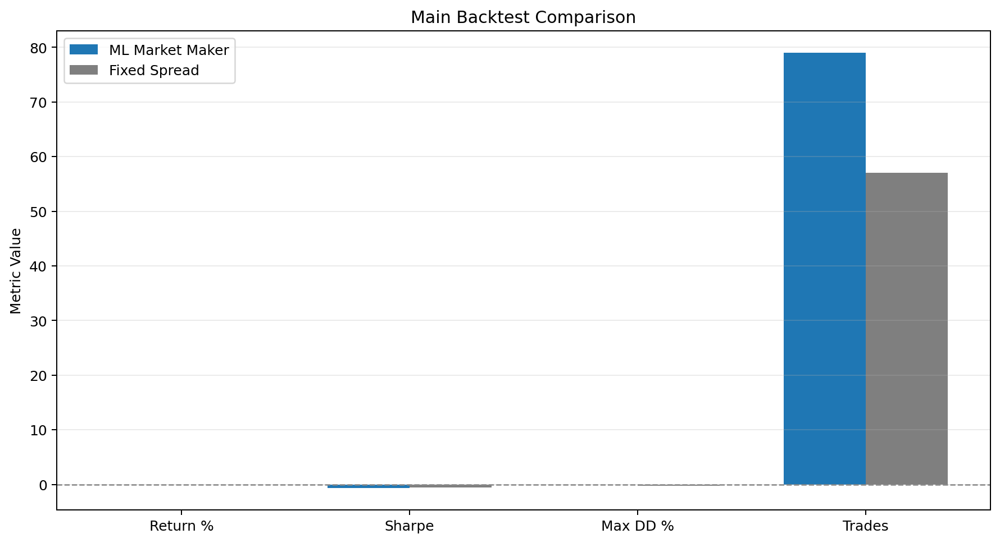
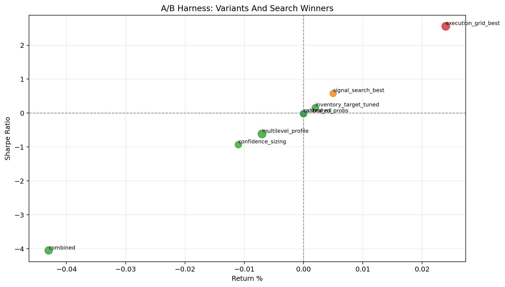
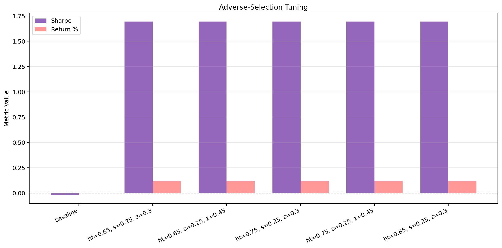
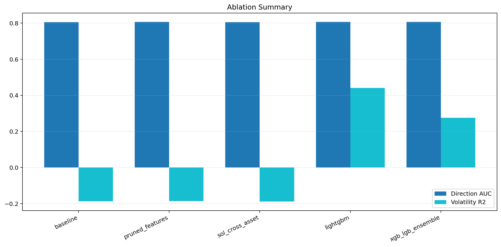

# Using Machine Learning for Short-Horizon Crypto Market Making

Author(s): [Add Name(s)]

Course: CS439 Final Project

Date: May 2026

## Editing Notes

- This file is the editable master draft for the paper.
- It is plain Markdown so it can be revised quickly in VS Code.
- Supporting files for updates live in [paper/results_snapshot.md](./results_snapshot.md), [paper/rerun_notes.md](./rerun_notes.md), and [paper/figures](./figures).

## Abstract

This project asks a simple question: can machine learning help a short-horizon crypto trading strategy make better quoting decisions than a simpler rule-based baseline? Here, market making means continuously posting buy and sell quotes and trying to earn the gap between them while controlling risk. The study uses 5-minute ETH/USDT data as the main market, adds related information from BTC/USDT, SOL/USDT, and Coinbase ETH/USD, and includes cached order-book and execution features. The modeling pipeline combines boosted-tree models, a neural model, and an ensemble, but the main result is easy to summarize. Prediction quality is strong: the mean walk-forward AUC is 0.7854, which means the model ranks up versus down moves much better than chance. Trading results are much less stable: only 2 of 6 walk-forward folds have positive Sharpe, and the main backtest remains slightly negative on Sharpe. The strongest improvements come from how the strategy executes trades rather than from more complex prediction alone. In the completed full A/B rerun, the best execution-grid configuration reaches 0.024% return and Sharpe 2.558, while the best signal-parameter candidate reaches only 0.005% return and Sharpe 0.578. The adverse-selection sweep also improves Sharpe from -0.020 to 1.693. Overall, the project suggests that machine learning is useful for prediction, but turning that predictive signal into better trading depends more on execution and risk-control design than on classifier accuracy by itself.

## 1. Introduction

Market making means posting both buy and sell quotes and trying to earn the spread, the gap between those prices. In crypto markets, this is difficult because market conditions can change quickly. A spread that looks reasonable in a calm market can become too narrow during a volatile move and too wide during a quiet period. When that happens, the strategy can be filled at the wrong time or end up holding too much inventory in the wrong direction.

This project asks whether a machine learning system can make those quoting decisions better than a simpler fixed-spread baseline. The goal is not just to predict whether price will go up or down. The real goal is to use those predictions to decide how wide quotes should be, how large orders should be, and how much inventory risk the strategy should take.

To answer that question, the project evaluates the system at several levels. First, it checks whether the model predicts direction better than chance. Second, it checks whether that predictive edge survives inside a trading simulation. Third, it studies which strategy changes actually matter most, because a useful model is not enough if the trading rules are the real bottleneck.

## 2. Data And Environment

The study uses a self-contained offline repository. All data files, cached features, trained model artifacts, scripts, and saved results needed for the main workflow are included in one place. This makes the project reproducible without relying on live trading software or outside services.

The main dataset is ETH/USDT at a 5-minute frequency. BTC/USDT and SOL/USDT are included as related assets, and Coinbase ETH/USD is used as a reference market. The repository also includes cached order-book and execution data, which makes repeated runs faster and more consistent.

Because the repository includes both data and trained artifacts, it can be used in two ways: as a reproducible submission folder with the saved outputs already included, or as a starting point for retraining the models from scratch.

## 3. Methods

### 3.1 Feature Engineering

The model uses several groups of inputs. Standard price-based features capture recent returns, momentum, trend, and volatility. Cross-asset features add information from BTC and SOL, since major crypto assets often move together. Order-book features summarize buying and selling pressure, while execution features describe how recent orders were filled. A separate regime model summarizes the current market state, such as whether conditions look calm, stressed, or strongly trending.

The final training stack uses 153 features. The ablation study uses a smaller 101-feature baseline so that individual changes can be tested more cleanly. In other words, the ablation study is designed to isolate what helps, not to exactly copy the full production-style stack.

### 3.2 Prediction Targets

The main prediction task is simple: predict whether price will be higher or lower 30 minutes later. The project also trains shorter- and medium-horizon direction models so the system can compare signals across time scales. For volatility, the target is how much price is likely to move over that same horizon. A separate three-class setup predicts down, flat, or up for diagnostic analysis.

### 3.3 Model Stack

The core predictive models are gradient-boosted trees. XGBoost handles the main up/down task, while LightGBM or XGBoost handles volatility. The repository also includes a PyTorch sequence model and an ensemble layer that combines several signals. In practice, the system can also scale back or ignore a prediction when confidence is low or when different model views disagree.

### 3.4 Validation And Backtest Design

The evaluation process has four layers. First, purged walk-forward validation tests the model on later time blocks after training on earlier ones, with small gaps between them to reduce data leakage. Second, a backtest compares the ML-based strategy with a simpler fixed-spread baseline. Third, A/B tests compare specific trading-rule changes one at a time. Fourth, ablation tests remove or add individual features or model choices to see which changes actually help.

## 4. Experimental Setup

The repository supports both PowerShell wrappers and direct Python commands. The main workflow used in this report is:

```powershell
pwsh ./scripts/run_train.ps1
pwsh ./scripts/run_backtest.ps1
pwsh ./scripts/run_backtest_ab.ps1
python ./backtest.py --as-sweep
pwsh ./scripts/run_experiments.ps1
python ./paper/generate_paper_assets.py
```

For a general data science reader, the important point is that all experiments were run offline on historical data, and each stage wrote saved result files that were then used to build the paper figures. The A/B harness produces three kinds of evidence: preset strategy variants, a 54-candidate search over execution settings, and a 1,440-candidate search over signal settings.

## 5. Results

### 5.1 Walk-Forward Validation

The walk-forward results show an important gap between prediction quality and trading quality. Direction AUC stays well above chance in all six folds, ranging from 0.7314 to 0.8126, with a mean of 0.7854. AUC measures how well the model ranks up versus down moves, and 0.5 would be random guessing. However, only two folds produce positive Sharpe ratios, and the mean fold Sharpe is -1.8387. Sharpe is a risk-adjusted return measure, so negative values indicate weak trading performance after accounting for variability.

| Fold | Direction AUC | Accuracy | Sharpe | Return % | Trades |
| --- | ---: | ---: | ---: | ---: | ---: |
| 0 | 0.7314 | 0.6707 | -3.059 | -0.069 | 282 |
| 1 | 0.7791 | 0.6994 | -8.182 | -0.274 | 919 |
| 2 | 0.8001 | 0.7186 | 4.737 | 0.115 | 542 |
| 3 | 0.8126 | 0.7323 | -6.509 | -0.102 | 331 |
| 4 | 0.8045 | 0.7266 | -0.136 | -0.002 | 242 |
| 5 | 0.7847 | 0.7050 | 2.117 | 0.027 | 99 |

In short, the model seems to learn something real about price direction, but that signal is not strong enough on its own to make the trading strategy consistently good. A model can look solid on prediction metrics and still perform poorly once it is turned into actual trading decisions.



Figure 1. Purged walk-forward validation across six folds, showing directional AUC and trading Sharpe with fold return overlay.

Source: Author-generated from `walk_forward_results.json` via `paper/figure_data/walk_forward_summary.csv`.

### 5.2 Main Backtest

The main backtest tells a similar story. Relative to the fixed-spread baseline, the ML strategy loses less money and keeps drawdown much smaller, but it still does not beat the baseline on risk-adjusted performance. The ML strategy finishes with -0.007% return versus -0.029% for the fixed baseline, and it reduces max drawdown from -0.276% to -0.054%. However, Sharpe remains slightly worse at -0.616 versus -0.529.

| Metric | ML Market Maker | Fixed Spread |
| --- | ---: | ---: |
| Total return % | -0.007 | -0.029 |
| Sharpe ratio | -0.616 | -0.529 |
| Max drawdown % | -0.054 | -0.276 |
| Trades | 79 | 57 |
| Final portfolio USD | 9999.33 | 9997.10 |
| Average inventory USD | 45.80 | 237.31 |

The extracted-copy portability run also exposed an important diagnostic. A safety filter called the conformal gate muted the directional signal on every candle in that test window, which pushed the effective directional AUC down to 0.5000, essentially random. In plain terms, the model may be learning useful patterns, but the runtime safeguards were conservative enough to remove most of that advantage in this period.



Figure 2. Main backtest comparison between the ML market maker and the fixed-spread baseline across return, Sharpe, drawdown, and trade count.

Source: Author-generated from `backtest_results.json` via `paper/figure_data/backtest_comparison.csv`.

### 5.3 A/B Variants And Execution Tuning

The completed full May 10 A/B rerun asks a straightforward question: if the prediction model stays the same, which trading-rule changes help the most? The answer is that the small preset strategy variants help only a little. Among the named variants, only `inventory_target_tuned` is mildly positive, while `combined` remains strongly negative.

| Variant | Return % | Sharpe | Trades |
| --- | ---: | ---: | ---: |
| control_ml | -0.000 | -0.020 | 52 |
| inventory_target_tuned | 0.002 | 0.156 | 54 |
| multilevel_profile | -0.007 | -0.616 | 79 |
| confidence_sizing | -0.011 | -0.935 | 52 |
| calibrated_probs | -0.000 | -0.020 | 52 |
| combined | -0.043 | -4.053 | 70 |

The stronger result comes from the completed execution-grid search inside the A/B harness. That search finished all 54 candidates and found the best overall configuration in the report:

- number of quote levels: 2
- spacing between quote levels: 0.08%
- maximum order size: 70 USD
- inventory-balance adjustment strength: 0.15
- return: 0.024%
- Sharpe: 2.558

The completed search over signal settings reinforces the same conclusion, but with a smaller effect. It tested all 1,440 candidates, but none met the 150-trade eligibility threshold, so the report selected the best fallback candidate across all tested settings. That candidate used a 0.22% base spread, direction weight 0.30, volatility weight 0.60, confidence threshold 0.50, and a 25 USD order size, producing 0.005% return with Sharpe 0.578 over 50 trades. This is better than the best named variant, but still well below the execution-grid winner.

For a general data science audience, the main takeaway is simple: changing how the system executes trades mattered more than making the prediction signal slightly more aggressive. Better predictions helped, but execution design helped more. The A/B figure below reflects the completed full report by combining named variants with the best execution-grid and signal-search candidates, while `paper/figures/ab_experiments_full_snapshot.png` keeps the named-variants-only view.



Figure 3. Full A/B harness comparison of named strategy variants plus the best execution-grid and signal-search candidates on return and Sharpe.

Source: Author-generated from `backtest_ab_results.json` via `paper/figure_data/ab_experiments.csv`. Named-variants-only companion view: `paper/figure_data/ab_experiments_full_snapshot.csv`.

### 5.4 Adverse-Selection Sweep

Adverse selection means getting filled just before the market moves against the strategy. This sweep is one of the clearest positive results in the project. Starting from a baseline Sharpe of -0.0201, the sweep finds parameter settings that improve Sharpe to 1.693 and lift total return to 0.1157% while slightly reducing drawdown.

| Configuration | Sharpe | Return % | Max drawdown % | Trades |
| --- | ---: | ---: | ---: | ---: |
| Baseline | -0.0201 | -0.0019 | -0.2677 | 267 |
| Best AS candidate | 1.6930 | 0.1157 | -0.2507 | 234 |

The best parameters are:

- high threshold: 0.65
- spread multiplier strength: 0.25
- size multiplier strength: 0.30

This is a strong indication that filtering out bad trading conditions is not a side detail. In the current test window, that control materially improves the strategy and appears more important than many of the higher-level modeling tweaks.



Figure 4. Adverse-selection sweep comparing the baseline configuration with the strongest tuning candidates on Sharpe and return.

Source: Author-generated from `as_tuning_results.json` via `paper/figure_data/as_tuning.csv`.

### 5.5 Ablation Study

The ablation study asks which modeling choices actually matter. It produces two main findings. First, the direction task is relatively stable across feature and model changes, with most direction AUCs clustered around 0.806. Second, the volatility task is much more sensitive to model family, with LightGBM dramatically outperforming the baseline XGBoost volatility setup.

| Experiment | Direction AUC | Direction Acc | Volatility R2 | Volatility MAE |
| --- | ---: | ---: | ---: | ---: |
| Baseline XGBoost | 0.8060 | 0.7239 | -0.1873 | 0.003051 |
| Pruned features | 0.8064 | 0.7246 | -0.1864 | 0.003051 |
| Add SOL features | 0.8058 | 0.7214 | -0.1888 | 0.003055 |
| LightGBM | 0.8062 | 0.7253 | 0.4409 | 0.001744 |
| XGB + LGB ensemble | 0.8066 | 0.7246 | 0.2749 | 0.002263 |

The horizon comparison shows that the 30-minute target remains best among the tested binary horizons, outperforming both 15-minute and 60-minute versions. The three-class direction setup reaches the best directional AUC at 0.8156 for an up-versus-rest view, although its raw three-class accuracy is only 0.5941. Finally, the quantile volatility model achieves 0.7773 coverage at the 0.75 quantile, which is close to its intended target but still not as strong overall as LightGBM’s standard regression model.



Figure 5. Ablation comparison of direction AUC and volatility R2 across the baseline and key model variants.

Source: Author-generated from `experiments_results.json` via `paper/figure_data/ablation_summary.csv`.

## 6. Discussion

The simplest summary of the project is that a model can look good on prediction metrics without producing a strong trading strategy. The supervised models are clearly better than chance on direction prediction, and the ablation study shows fairly stable results on that task. However, the main backtest and most walk-forward trading folds remain weak. That mismatch means the bottleneck is not just whether the classifier can rank candles correctly.

The evidence points to three practical explanations. First, the runtime safety logic appears very conservative in the current evaluation window. During the extracted-copy validation run, the conformal gate neutralized all candles in the main backtest. Second, execution and inventory design matter substantially. The completed full A/B rerun shows that named overlays are weak, the signal-parameter sweep helps somewhat, and the execution-grid search still finds the clear best candidate at Sharpe 2.558. Third, adverse-selection control matters enough to change the sign of Sharpe in its standalone sweep.

Taken together, these observations suggest that the next step is not simply to chase a higher model score. The more valuable work is likely to be better calibration of the safety gates, better execution settings, and a better mapping from model confidence to actual trading decisions.

## 7. Limitations

This study has several important limitations. It is still an offline simulation, so the fill model, fee assumptions, and execution penalties may not match live behavior. The main trading task is concentrated on one pair, ETH/USDT, even though cross-asset information is included. In the completed signal-parameter sweep, none of the 1,440 candidates met the 150-trade eligibility threshold, so the reported signal-search winner should be read as the best fallback candidate rather than as a clean winner among heavily traded settings. More broadly, the conservative safety gates in the current evaluation window may hide some of the model’s predictive value.

## 8. Conclusion

The answer to the project question is partly yes and partly no. Yes, the machine learning models clearly improve short-horizon prediction quality: the walk-forward AUC is strong, the direction models are consistently above chance, and the volatility model improves substantially when the right learner is chosen. No, that predictive edge does not automatically translate into a strong trading system under the current execution policy. The main backtest remains slightly negative on Sharpe, and most walk-forward trading folds are not profitable.

The clearest positive evidence comes from the execution and adverse-selection results. In the completed full A/B rerun, the execution-grid search reached Sharpe 2.558, while the fully completed signal-parameter sweep reached only 0.578 Sharpe and did not displace the execution-grid winner. The adverse-selection sweep improved Sharpe from -0.020 to 1.693. For a general data science class, the clearest conclusion is this: the models do learn useful structure, but model accuracy alone was not enough to create a strong end-to-end system. How predictions are turned into decisions mattered just as much, and in this project it mattered more.

## Appendix A. Reproducibility

The repository is self-contained for offline use. The main reproducibility artifacts are:

- source scripts under `train.py`, `backtest.py`, and `experiments.py`
- local market data under `data/`
- model artifacts under `models/latest/`
- evaluation JSON files in the repository root
- generated report assets under `paper/`

The main reproducibility commands are:

```powershell
pwsh ./scripts/run_setup_doctor.ps1
pwsh ./scripts/run_train.ps1
pwsh ./scripts/run_backtest.ps1
pwsh ./scripts/run_backtest_ab.ps1
python ./backtest.py --as-sweep
pwsh ./scripts/run_experiments.ps1
python ./paper/generate_paper_assets.py
```

## Appendix B. Zip Portability

Zip portability was verified directly in this session. The repository was compressed, extracted to a new path with spaces outside the original root, and run from the extracted copy. The extracted-copy checks that succeeded were:

- `scripts/run_setup_doctor.ps1`
- `scripts/run_backtest.ps1`
- `paper/generate_paper_assets.py`

This proves that the repository does not require the original `C:\freqtrade\cs439_final_project` path and that the main offline workflow works from an extracted folder. It does not prove literal compatibility with every PC regardless of environment. A target PC still needs:

- Windows PowerShell for the wrapper scripts, or direct use of the Python commands
- Python 3.11 or newer
- the packages in `requirements.txt`
- enough disk space for the bundled data and outputs

The wrapper scripts are portable because they prefer a local `.venv`, then a parent `.venv`, and finally `python` on `PATH`. In the extracted-copy verification, the wrappers successfully used the `python` fallback.
